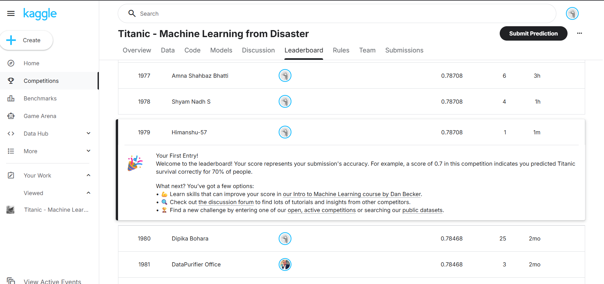

# Titanic Survival Prediction 🚢

## Overview
Machine learning project to predict Titanic passenger survival.
- **Accuracy:** ~78%
- **Kaggle Leaderboard Rank:** 1979

## Dataset
From [Kaggle Titanic Competition](https://www.kaggle.com/competitions/titanic)

## Project Structure
- `Titanic_EDA.ipynb` — Main notebook (EDA + modeling)
- `Data/` — Train, test, and prediction CSVs
- `requirements.txt` — Dependencies

## How to Run
```bash
pip install -r requirements.txt
jupyter notebook Titanic_EDA.ipynb
```

## Results
| Metric | Score |
|--------|-------|
| Accuracy | ~78% |
| Kaggle Rank | 1979 |

